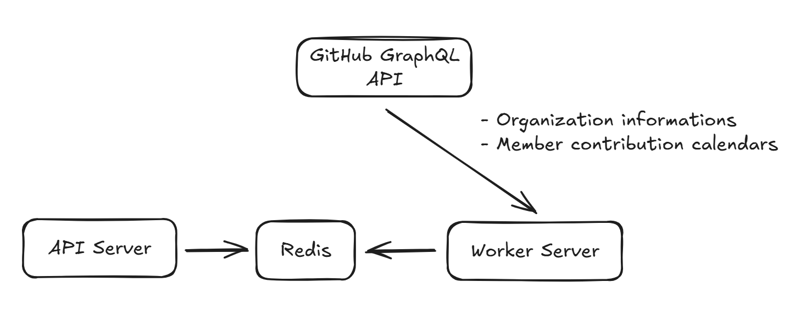

# GitRank
`Go` `Fiber V2` `Redis` | `Github GraphQL API`\
GitHub Organization Ranking API
> a toy project for practicing GitHub API usage and caching.


<video src="./test.mp4" controls width="600"></video>

---

1. **Clone the repository and install dependencies:**
   ```sh
   git clone https://github.com/yourusername/gitrank.git
   cd gitrank
   go mod tidy
   ```

2. **Configure environment variables:**
   - Copy `example.env` to `.env` and fill in your values (GitHub token, Redis, etc).

3. **Run Redis server:**
   - If you have Docker installed Or install Redis locally and start the server.

4. **Run Worker server**
    ```sh
    go run cmd/worker/main.go
    ```
   
5. **Run the API server:**
   ```sh
   go run cmd/api/main.go
   ```

6. **Make a request:**
   - Example:
     ```sh
     curl http://localhost:2626/rank
     ```
   - The API will return ranking data in JSON format.

---
